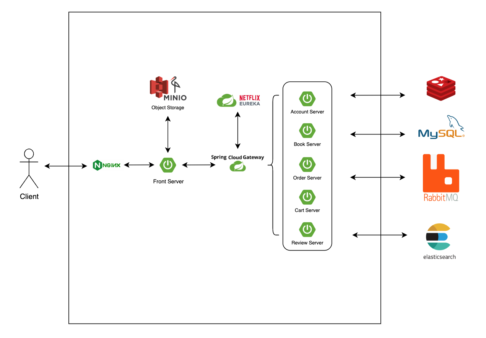

# 📚 온라인 서점: 북팡문고

## 📑 프로젝트 소개

**북팡문고**는 Spring Boot를 기반으로 구현한 온라인 서점 플랫폼입니다. 사용자는 다양한 도서를 검색하고, 장바구니에 담아 구매할 수 있으며, 편리한 온라인 독서 경험을 제공하는 것을 목표로 합니다.

 

## 🌐 서비스 바로가기

 

## 🧑‍💻 팀원 소개

| 이름 | GitHub |
| :--: | :--: |
| 김산이 | [[GitHub 프로필 링크]](https://github.com/sanikani) |
| 김용재 | [[GitHub 프로필 링크]](https://github.com/flashdragon) |
| 박은총 | [[GitHub 프로필 링크]](https://github.com/parkeunchong) |
| 이현주 | [[GitHub 프로필 링크]](https://github.com/jucie333) |
| 임동혁 | [[GitHub 프로필 링크]](https://github.com/ehdgur123) |
| 전승우 | [[GitHub 프로필 링크]](https://github.com/tmddn7475) |
| 조민권 | [[GitHub 프로필 링크]](https://github.com/chomk1227) |
| 홍주혁 | [[GitHub 프로필 링크]](https://github.com/juhyeok0418) |

 

## ✨ 주요 기능

* **📚 도서 검색**: 제목, 저자, 출판사 등 다양한 조건으로 도서를 검색할 수 있습니다.
* **🛒 장바구니**: 원하는 도서를 장바구니에 추가하고 수량을 조절할 수 있습니다.
* **💳 주문 및 결제**: 장바구니의 상품을 주문하고, 간편 결제를 통해 구매를 완료할 수 있습니다.
* **👤 마이페이지**: 주문 내역, 배송 상태, 회원 정보 수정 등 개인화된 서비스를 제공합니다.
* **🔐 회원 관리**: Spring Security를 활용하여 안전한 회원가입 및 로그인/로그아웃 기능을 구현했습니다.

 

## 💻 담당 업무

| 구분 | 기능 | 담당자 |
| :---: | :--- | :---: |
| **인프라** | CI/CD 구축(GitHub Action) | 김산이 |
| | Spring Cloud 환경 구성(Gateway, eureka) | 김산이, 김용재, 전승우 |
| | 무중단 배포 | 김산이, 김용재 |
| **인증/인가** | JWT 기반의 인증/인가 | 김용재 |
| | 일반/페이코 로그인 | 김용재 |
| **회원** | 회원 가입, 주소 관리, 등급 관리, 탈퇴, 휴면 | 김용재 |
| | (관리자) 회원관리 | 김용재 |
| **도서** | (관리자) 도서 관리 CRUD | 김용재, 이현주 |
| | (관리자) 출판사/저자 CRUD | 김용재 |
| | (관리자) 외부 API/TUI Editor 활용 도서 등록 | 이현주 |
| | 이미지/카테고리 관리 | 김용재 |
| | Tag 관리 | 김용재, 이현주 |
| | 좋아요 기능 | 이현주 |
| | 선물포장 설정 | 김산이 |
| | 도서 상세 페이지 view | 김용재, 이현주 |
| **검색** | 검색 가중치, 정렬 기준, 동의어/유의어 검색 적용 | 이현주 |
| **장바구니** | 회원/비회원 장바구니, 장바구니 영구 유지 | 임동혁 |
| **주문** | 회원/비회원 주문 및 주문 취소 | 김산이, 전승우 |
| | 주문 옵션 설정 (포인트, 배송일, 포장 등) | 김산이, 전승우 |
| | 주문 내역 조회 (회원) | 김산이 |
| | 주문 내역 조회 (비회원) | 김산이, 전승우 |
| | (관리자) 주문 상태 관리 | 김산이, 전승우 |
| **결제** | 토스페이 연동 | 전승우 |
| | 포인트 결제 / 쿠폰 적용 | 김산이 |
| **리뷰** | 리뷰 구현 | 홍주혁 |
| **쿠폰** | Welcome/생일 쿠폰 | 조민권 |
| | 도서/카테고리 쿠폰 | 김산이, 조민권 |
| **포인트** | MQ 적용 | 조민권 |
| | 포인트 정책(신규/주문 적립), (관리자) 규정 설정 | 김산이 |
| | 포인트 정책(리뷰 적립) | 김산이, 홍주혁 |
| **MyPage** | 회원 정보 수정 | 김용재 |
| | 쿠폰/포인트 내역 조회 | 김산이 |
| | 좋아요 내역 조회 | 이현주 |
| **기타** | Thymeleaf Layout Template, ConfigServer | 김용재 |

 

## 🛠️ 기술 스택

| 구분 | 기술 |
| :---: | :--- |
| **Back-End** |         |
| **Front-End** |     |
| **Infra** |       |
| **Database** |  |

 

## 🏛️ 아키텍처

